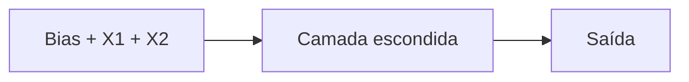
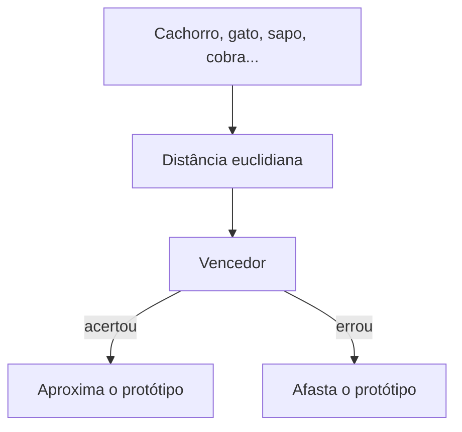
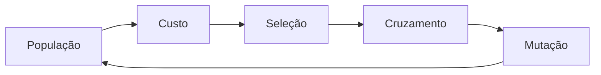

# IA Faculdade — Redes Neurais

Atividades de **Inteligência Artificial** em [Scilab](https://www.scilab.org/download): do perceptron até algoritmo genético.

Feito por [Raphaela](https://github.com/Raphaelacristiane667) · códigos prontos para rodar e para enviar no AVA.


---

## O caminho das atividades

```text
PMC  →  PMC 2 saídas  →  LVQ  →  RBF  →  AG  →  AG com restrições
 rede supervisionada     distância   gaussiana     evolução
```

| # | Tema | Arquitetura / ideia | Pasta | Envio AVA |
|---|------|---------------------|-------|-----------|
| 1 | Perceptron Multicamadas | 3 → 10 → 1 | `01-pmc-3-10-1` | `ava-envio/Atividade_01_PMC.txt` |
| 2 | PMC com 2 saídas | 3 → 2 → 2 | `02-pmc-3-2-2` | `ava-envio/Atividade_02_PMC.txt` |
| 3 | LVQ — classificar animais | 5 atributos → 3 classes | `03-lvq-animais` | `ava-envio/Atividade_03_LVQ.txt` |
| 4 | RBF / gaussiana | 2 entradas → 1 centro | `04-rbf-gaussiana` | `ava-envio/Atividade_04_RBF.txt` |
| 5 | Algoritmo genético | aquário de 100 L | `05-algoritmo-genetico-aquario` | `ava-envio/Atividade_05_AG.txt` |
| 6 | AG com restrições | volume + proporção 2,5 | `06-ag-aquario-restricoes` | `ava-envio/Atividade_06_AG_restricoes.txt` |

---

## 1 e 2 — Perceptron Multicamadas

Aprende pelo erro: sigmoid na frente, **backpropagation** para trás.



- **Atividade 1:** 10 neurônios escondidos, **1 saída**, 10.000 épocas, taxa `0,6`. Alvos no estilo XOR (`0.1` … `0.4`).
- **Atividade 2:** 2 neurônios escondidos, **2 saídas** (`00`, `01`, `01`, `10`) — XOR de 2 bits.

---

## 3 — LVQ (Learning Vector Quantization)

Não usa sigmoid. Classifica o animal pelo **protótipo mais perto**.



**Entradas:** 4 patas · 2 patas · pelo · alimentação · habitat  
**Classes:** 1 mamífero · 2 anfíbio · 3 réptil

A taxa começa em `0,1` e cai 1% por época (`n = n * 0.99`), em 500 épocas.

---

## 4 — RBF gaussiana

Um centro começa em `(2, 2)` e **anda até os pontos**. A cada passo o Scilab redesenha a superfície 3D.

`φ = exp(−distância)`

Quanto mais perto do centro, maior a ativação.

---

## 5 e 6 — Algoritmo genético (aquário)

Aqui não é rede neural: a população **evolui** as medidas do aquário.

| | Atividade 5 | Atividade 6 |
|---|---|---|
| População | 10 | 50 |
| Épocas | 1.000 | 2.000 |
| Objetivo | volume ≈ 100.000 cm³ | volume + comprimento ≈ 2,5 × altura |
| Seleção | pais aleatórios | torneio |
| Cruzamento | média | SBX |
| Extra | mutação 5% | faixas de medida + elitismo |



---

## Como rodar

1. Instale o [Scilab](https://www.scilab.org/download) (Windows: baixe o `.exe`).
2. Abra o arquivo `.sce` da pasta da atividade.
3. Execute no Scilab (**File → Execute...** ou arraste o arquivo).

Os `.txt` em `ava-envio/` são os **mesmos códigos**, no formato pedido pelo AVA (1 arquivo por vez). Os textos para colar no comentário estão em `ava-envio/TEXTOS_PARA_O_AVA.txt`.

---

## Pastas

```text
ia-faculdade/
├── 01-pmc-3-10-1/
├── 02-pmc-3-2-2/
├── 03-lvq-animais/          + planilha dos animais
├── 04-rbf-gaussiana/
├── 05-algoritmo-genetico-aquario/
├── 06-ag-aquario-restricoes/
└── ava-envio/               arquivos .txt para o AVA
```
